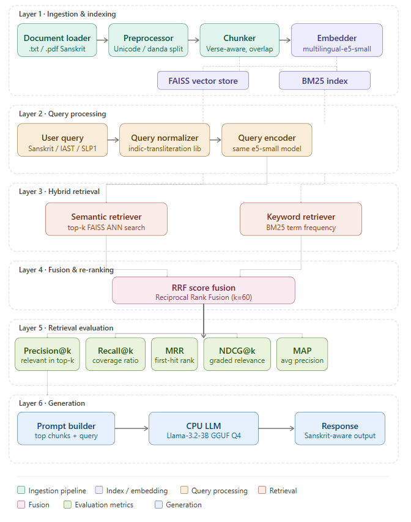
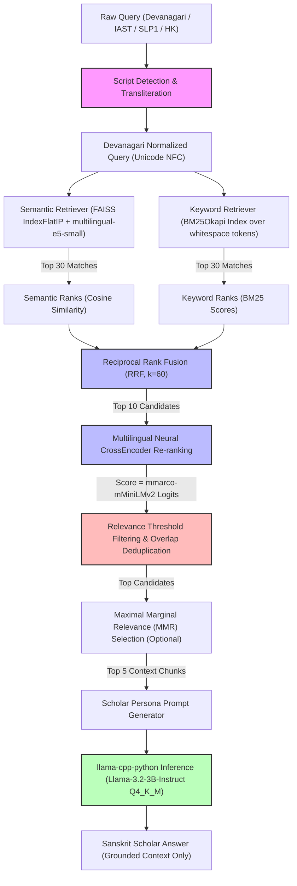

# Sanskrit Retrieval-Augmented Generation (RAG) System

An end-to-end, evaluation-driven Sanskrit RAG system featuring query transliteration, dual hybrid indexing (FAISS semantic & BM25 keyword search), Reciprocal Rank Fusion (RRF), Cross-Encoder re-ranking, and local GGUF LLM inference.

This repository was engineered to address specific linguistic and retrieval challenges in low-resource classical languages, moving away from "black-box" frameworks to build a transparent, highly tunable information retrieval pipeline.

---

## System Architecture

The workflow below details how a Sanskrit query regardless of its script transliteration scheme is normalized, matched, fused, re-ranked, and finally resolved by a local Language Model.



### Interactive Flow Diagram


---

## Core Engineering Features

### 1. Transliteration-Aware Query Normalization
Sanskrit texts are widely consumed and queried across different scripts. To prevent retrieval failure due to script mismatches, the system incorporates a custom transliteration engine:
* **Automatic Script Detection**: Heuristically distinguishes between Devanagari, IAST, SLP1, and Harvard-Kyoto (HK) using character profiles, digraph detection (e.g., `kh`, `gh`, `sh`), and uppercase/lowercase patterns.
* **Normalization Pipeline**: Converts all query scripts to Devanagari using `indic-transliteration` and normalizes output to **Unicode NFC** standard to ensure consistent matching against indexed Devanagari text.
* **Informal Spelling Mapper**: Maps informal or colloquial spellings (e.g., `w` to `v`, word-final `h` to `H` / Visarga) to robustly handle user queries.

### 2. Dual Hybrid Retrieval & RRF
To balance semantic understanding with strict keyword matching:
* **Dense Retrieval**: Extracts semantic matches using `intfloat/multilingual-e5-small` embeddings and stores them in a FAISS inner product index (`IndexFlatIP`). The system automatically prepends `"passage: "` during ingestion and `"query: "` during search as required by the E5 model.
* **Sparse Retrieval**: Uses `rank_bm25` (BM25Okapi) for token-based lexical searches to capture specific Sanskrit names, nouns, and vocabulary.
* **Reciprocal Rank Fusion (RRF)**: Fuses dense and sparse rankings using an RRF parameter ($k=60$). This ranks results by combined retrieval order rather than raw, non-comparable similarity scores.

### 3. Neural Re-ranking & Deduplication
* **Cross-Encoder Scoring**: Re-evaluates the top 10 fused candidates using `cross-encoder/mmarco-mMiniLMv2-L12-H384-v1` to output highly accurate relevance logits.
* **Overlap Deduplication**: In low-resource settings, overlapping chunks can crowd out the context window. The system discards candidates sharing $>50\%$ verse overlap, ensuring context diversity.
* **Maximal Marginal Relevance (MMR)**: Incorporates optional MMR selection ($\lambda = 0.7$) to dynamically trade off relevance score against semantic diversity, preventing redundant details from feeding the LLM.

### 4. Local & Grounded LLM Inference
* **Hardware-Local Execution**: Runs local GGUF inference using quantized `Llama-3.2-3B-Instruct-Q4_K_M` via `llama-cpp-python`.
* **Zero-Hallucination Prompting**: Instructs the model under a strict **Sanskrit Scholar** persona to formulate answers **only** if the answer is explicitly supported by the retrieved verses, returning an error message otherwise.

---

## 🔬 Experimental Benchmarking & Ablation Study

To optimize retrieval performance, a custom benchmark of **21 manually annotated Sanskrit queries** with mapped ground-truth verse ranges was constructed. 

Rather than evaluating by chunk ID which changes with chunking settings **evaluation is performed at the verse level**. This decouples the evaluation benchmark from chunking choices and allows for scientific ablation testing:

### Retrieval Ablation Results ($k=5$)

| Chunking Configuration | Mean Precision@5 | Mean Recall@5 | Mean MRR | Mean NDCG@5 | MAP |
| :--- | :---: | :---: | :---: | :---: | :---: |
| **4 Verses + 1 Overlap (Selected)** | **0.4667** | **0.6667** | **0.9365** | **0.7105** | **0.5973** |
| 3 Verses + 0 Overlap | 0.2857 | 0.5556 | 0.9206 | 0.6167 | 0.5126 |
| 2 Verses + 0 Overlap | 0.3333 | 0.4794 | 0.8730 | 0.5390 | 0.4031 |

### Key Observations & Rationale:
* **Coherence Wins**: Contrary to typical RAG practices where smaller chunks are preferred to reduce noise, smaller chunks (2-3 verses without overlap) actually **reduced retrieval performance** in Sanskrit.
* **Context Preservation**: The **4-Verse, 1-Overlap** setting provides the necessary contextual coherence for Sanskrit compound structures (Sandhi) and stories, yielding a highly robust **MRR of 0.9365** (relevant verses reliably rank as the first or second result).

---

## Project Directory Layout

```text
RAG_Sanskrit_Raviteja_Beri/
├── code/
│   ├── config.py              # Central configuration (hyperparameters, paths, thresholds)
│   ├── ingest.py              # Ingests documents, parses verses, creates FAISS & BM25 indices
│   ├── retriever.py           # Script detection, transliteration, hybrid search, RRF, MMR
│   ├── generator.py           # Context-grounded llama-cpp local inference wrapper
│   ├── evaluator.py           # Custom verse-level IR metric runner (P@5, R@5, MRR, NDCG, MAP)
│   ├── generate_pdf_report.py  # ReportLab script generating styled, multi-page PDF reports
│   └── pipeline.py            # CLI interface for end-to-end testing and query execution
├── data/
│   ├── Rag-docs.docx          # Source narrative corpus (Mūrkhabhṛtyasya, Devabhakta, etc.)
│   └── test_queries.json      # 21 hand-labeled query-answer evaluation pairs
├── index/                     # Index storage folder (auto-generated)
│   ├── faiss_index            # Serialized FAISS IndexFlatIP binary
│   ├── bm25_index.pkl         # Serialized BM25 index file
│   └── chunks_metadata.pkl    # Metadata mapping chunks to source files & verse IDs
├── report/                    # Output directory for evaluations
│   ├── eval_results.csv       # Raw query-by-query evaluation metrics
│   └── eval_results.pdf       # Professional, styled evaluation PDF report
├── requirements.txt           # Project dependencies
└── README.md                  # Project documentation
```

---

## Execution & Setup Guide

### 1. Environment Activation
Activate the pre-configured Python virtual environment:
```powershell
# Windows PowerShell
.\Sanskrit_RAG\Scripts\activate
```

### 2. Download LLM Weights
Download the quantized 3B local model weights from Hugging Face into the `models` directory:
```powershell
huggingface-cli download bartowski/Llama-3.2-3B-Instruct-GGUF --include "Llama-3.2-3B-Instruct-Q4_K_M.gguf" --local-dir ./models
```

### 3. Ingest Documents & Build Indexes
Parse the source document, clean Devanagari unicode, segment verses, and build FAISS/BM25 indexes:
```powershell
python code/ingest.py --data_path data/Rag-docs.docx
```

### 4. Run Evaluation Suite & Compile Report
Run retrieval metrics on the evaluation dataset. This outputs a CSV file and a printable PDF report under the `report/` folder:
```powershell
python code/evaluator.py
```

### 5. Query CLI Pipeline
Execute queries directly from the command line in Devanagari, IAST, SLP1, or Harvard-Kyoto (HK):
```powershell
# Example querying in Harvard-Kyoto script
python code/pipeline.py --query "vRddhA vanam gatvA kim apazyat?"

# Example querying in Devanagari script
python code/pipeline.py --query "वृद्धा वनं गत्वा कम् अपश्यत्?"
```

---

## Future Work

Potential improvements include:

* BGE-M3 embeddings
* multilingual-e5-large embeddings
* multilingual rerankers
* Sanskrit-specific embedding fine-tuning
* Query expansion and HyDE retrieval
* Larger benchmark datasets
* Larger Sanskrit corpora
